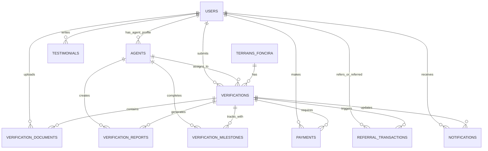

# FONCIRA Database - Entity Relationship Diagram

## Mermaid ERD Diagram



## Data Flow Diagram

```
┌─────────────────────────────────────────────────────────────────┐
│                    CLIENT INITIATES FLOW                         │
└─────────────────────────────────────────────────────────────────┘
                                │
                    ╔═══════════╩═══════════╗
                    │                       │
           ┌────────▼─────────┐   ┌────────▼─────────┐
           │  TERRAIN EXTERNE  │   │  TERRAIN FONCIRA │
           │  (Créer nouveau)  │   │  (Sélectionner)  │
           └────────┬─────────┘   └────────┬─────────┘
                    │                       │
                    ╚═══════════╦═══════════╝
                                │
                    ┌───────────▼──────────┐
                    │  VERIFICATIONS       │
                    │  status = receptionnee
                    └───────────┬──────────┘
                                │
                    ┌───────────▼──────────┐
                    │  Optionnel: Upload   │
                    │  DOCUMENTS           │
                    └───────────┬──────────┘
                                │
                    ┌───────────▼──────────┐
                    │  PAYMENTS            │
                    │  status = en_attente │
                    └───────────┬──────────┘
                                │
                    ┌───────────▼──────────┐
                    │  PAYMENTS status     │
                    │  = validee           │
                    └───────────┬──────────┘
                                │
        ╔═══════════════════════╩════════════════════════╗
        │                                                │
┌───────▼──────────┐              ┌──────────────────────▼───┐
│ AGENT ASSIGNÉ    │              │ EMAIL CONFIRMATION       │
│ Agent selection  │              │ + SMS WhatsApp           │
└───────┬──────────┘              └──────────────────────────┘
        │
        │ Auto-create des milestones
        │
┌───────▼──────────────────┐
│ VERIFICATION_MILESTONES  │
│ J1, J3, J7, J10          │
└───────┬──────────────────┘
        │ Agent complète les jalons
        │ Photos + Notes + GPS
        │
┌───────▼──────────────────┐
│ NOTIFICATIONS            │
│ Message proactif envoyé  │
└───────┬──────────────────┘
        │
┌───────▼──────────────────┐
│ VERIFICATION_REPORTS     │
│ Risk level + Verdict     │
│ Positive points          │
│ Points to verify         │
└───────┬──────────────────┘
        │
        └──► Client reçoit rapport

        │ Client choisit une action
        │
    ┌───┴────┐
    │         │
┌───▼──┐  ┌──▼──────┐  ┌─────────────┐
│Acheter│ │Accompagn.│ │Pas maintenant
└───┬──┘  └──┬──────┘  └─────┬───────┘
    │        │               │
    └────┬───┴───┬───────────┘
         │       │
      ┌──▼──┐  ┌─▼──────────────┐
      │Decision  REFERRAL Transaction
      │Recorded  (Si client = filleul)
      └─────┘   └────────────────┘
```

## Relationships Detail

### 1-to-Many Relationships

```
USERS (1) ──── (*) VERIFICATIONS
  └─ Un client peut faire plusieurs vérifications

USERS (1) ──── (*) PAYMENTS
  └─ Un client peut faire plusieurs paiements

USERS (1) ──── (*) NOTIFICATIONS
  └─ Un client receive plusieurs notifications

AGENTS (1) ──── (*) VERIFICATIONS
  └─ Un agent dirige plusieurs vérifications

VERIFICATIONS (1) ──── (*) VERIFICATION_DOCUMENTS
  └─ Une vérification peut avoir plusieurs documents

VERIFICATIONS (1) ──── (*) VERIFICATION_MILESTONES
  └─ Une vérification a 4 jalons (J1, J3, J7, J10)

VERIFICATIONS (1) ──── (1) VERIFICATION_REPORTS
  └─ Une vérification = Un rapport unique
```

### Many-to-Many Relationships

```
Implicit via REFERRAL_TRANSACTIONS:
USERS (*) ──── (*) USERS
  ├─ referrer_id → users.id (L'agent parrain)
  └─ referred_user_id → users.id (Le nouvau client)
```

---

## SQL Query Patterns

### Pattern 1: Client Dashboard

```sql
SELECT
  v.id, v.terrain_title, v.status, v.risk_level,
  v.submitted_at, v.expected_delivery_at,
  a.full_name as agent_name,
  COUNT(CASE WHEN m.status = 'termine' THEN 1 END) as completed_steps,
  p.status as payment_status
FROM verifications v
LEFT JOIN agents a ON v.agent_id = a.id
LEFT JOIN verification_milestones m ON v.id = m.verification_id
LEFT JOIN payments p ON v.id = p.verification_id
WHERE v.user_id = 'USER_ID'
GROUP BY v.id, a.full_name, p.status
ORDER BY v.submitted_at DESC;
```

### Pattern 2: Agent Dashboard

```sql
SELECT
  COUNT(CASE WHEN v.status != 'rapport_livre' THEN 1 END) as in_progress,
  COUNT(CASE WHEN v.status = 'rapport_livre' THEN 1 END) as completed,
  AVG(CASE
    WHEN vr.risk_level = 'faible' THEN 1
    WHEN vr.risk_level = 'modere' THEN 2
    WHEN vr.risk_level = 'eleve' THEN 3
  END) as avg_risk,
  a.average_rating,
  a.verifications_completed
FROM verifications v
LEFT JOIN verification_reports vr ON v.id = vr.verification_id
LEFT JOIN agents a ON v.agent_id = a.id
WHERE v.agent_id = 'AGENT_ID'
GROUP BY a.average_rating, a.verifications_completed;
```

### Pattern 3: Terrain Marketplace Listing

```sql
SELECT
  t.id, t.title, t.location, t.ville, t.price_fcfa, t.surface,
  t.document_type, t.seller_type,
  COALESCE(vr.risk_level, 'non_verifiee') as risk_level,
  COUNT(vr.id) as verification_count
FROM terrains_foncira t
LEFT JOIN verifications v ON t.id = v.terrain_id_foncira
LEFT JOIN verification_reports vr ON v.id = vr.verification_id
WHERE t.deleted_at IS NULL
GROUP BY t.id, vr.risk_level
ORDER BY t.created_at DESC;
```

### Pattern 4: Notification Timeline

```sql
SELECT
  n.id, n.title, n.message, n.created_at, n.is_read,
  n.notification_type,
  CONCAT(u.first_name, ' ', u.last_name) as sender,
  v.terrain_title
FROM notifications n
LEFT JOIN verifications v ON n.related_verification_id = v.id
LEFT JOIN users u ON v.agent_id = u.id
WHERE n.recipient_id = 'USER_ID'
ORDER BY n.created_at DESC
LIMIT 20;
```

---

## Table Statistics (Expected Growth)

```
Table                          Initial Data    Expected (1 year)
─────────────────────────────────────────────────────────────
users                          4               +1000
agents                         2               +50
terrains_foncira               3               +500
verifications                  1               +10,000
verification_documents         0               +50,000
verification_reports           1               +10,000
verification_milestones        4               +40,000
payments                       1               +10,000
referral_transactions          0               +5,000
notifications                  1               +100,000
testimonials                   0               +1,000
```

---

## Access Patterns (RLS Rules)

```
User Type: CLIENT
├─ Can read: own verifications, own payments, own notifications
├─ Can create: verifications, documents, testimonials
├─ Can update: own profile, own notifications (mark read)
├─ Can read: all marketplace terrains (public)
└─ Cannot: read other clients' data

User Type: AGENT
├─ Can read: assigned verifications + documents
├─ Can create: reports, milestones
├─ Can update: assigned verification status, milestone completion
├─ Can read: all agents (directory)
├─ Can update: own profile
└─ Cannot: create new terrains, delete data

User Type: ADMIN
├─ Can read: ALL tables
├─ Can create: all
├─ Can update: all
├─ Can delete: all (with soft-delete on users/terrains)
└─ Can: manage agents, review reports, monitor payments
```

---

## Indexes Visualization

### High-Traffic Queries Index Map

```
VERIFICATIONS (Most important)
├─ idx_verifications_user_id      ← Clients listing their verifications
├─ idx_verifications_agent_id     ← Agents listing assigned tasks
├─ idx_verifications_status       ← Dashboard filters
├─ idx_verifications_created_at   ← Timeline sorts
└─ idx_verifications_risk_level   ← Statistics

NOTIFICATIONS (High volume)
├─ idx_notifications_recipient_id ← Personal feed
├─ idx_notifications_is_read      ← Unread counter
└─ idx_notifications_created_at   ← Timeline

TERRAINS_FONCIRA (Frequent)
├─ idx_terrains_ville            ← City filter
├─ idx_terrains_document_type    ← Doc type filter
├─ idx_terrains_verification_status ← Risk status
└─ idx_terrains_price_fcfa       ← Range filtering

PAYMENTS (Critical)
├─ idx_payments_user_id          ← User's payment history
├─ idx_payments_status           ← Pending settlements
└─ idx_payments_created_at       ← Reporting
```

---

## Future Extension Points

The schema is designed to be extended:

### Option 1: Multi-Language Support

```sql
ALTER TABLE terrains_foncira ADD translations JSONB;
-- {"fr": {"title": "..."}, "en": {"title": "..."}}
```

### Option 2: Geographic Partitioning

```sql
-- Partition verifications by ville for large volume
PARTITION BY LIST (terrain_location)
```

### Option 3: Audit Trail

```sql
CREATE TABLE audit_log (
  id UUID PRIMARY KEY DEFAULT gen_random_uuid(),
  table_name VARCHAR(50),
  operation VARCHAR(10), -- INSERT, UPDATE, DELETE
  record_id UUID,
  changes JSONB,
  actor_id UUID REFERENCES users(id),
  created_at TIMESTAMP WITH TIME ZONE DEFAULT now()
);
```

### Option 4: Analytics Views

```sql
CREATE VIEW daily_verification_stats AS
SELECT
  DATE(submitted_at) as date,
  COUNT(*) as created,
  AVG(EXTRACT(DAY FROM (expected_delivery_at - submitted_at))) as avg_duration_days
FROM verifications
GROUP BY DATE(submitted_at)
ORDER BY date DESC;
```

---

## Performance Tuning

### Current Optimization

- ✓ Indexes on all FK and filter columns
- ✓ Timestamps on all tables for sorting
- ✓ ENUM types for fixed values (smaller storage)
- ✓ NUMERIC for money (precision, no float rounding)
- ✓ JSONB for flexible data (searchable, indexable)

### Future Optimizations (if needed)

1. **Materialized Views** for complex reports
2. **Read Replicas** for analytics queries
3. **Partitioning** when verifications > 1M rows
4. **Caching** (Redis) for frequently accessed data
5. **Archive Tables** for old verifications (> 2 years)

---

## Disaster Recovery

### Backup Strategy

```
├─ Hourly: WAL archiving
├─ Daily: Full snapshot backup
├─ Weekly: off-site backup
└─ Monthly: Long-term archive
```

### Recovery Point Objective (RPO): < 1 hour

### Recovery Time Objective (RTO): < 4 hours

---

**Generated:** April 2026  
**Database Version:** 1.0  
**Ready for Production**
